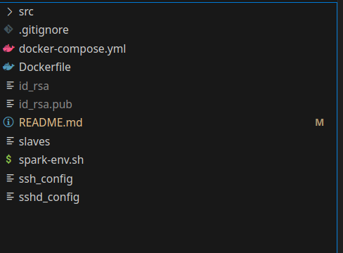
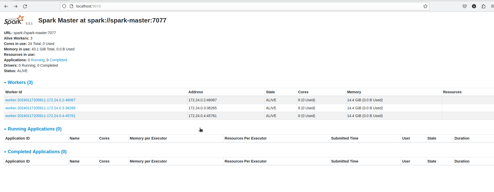
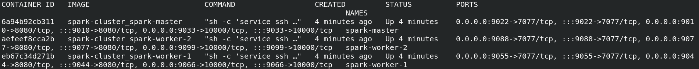

### How to?

Create a id_rsa and id_rsa.pub in the root of project (either from local or inside from docker container)

Run 

```bash 

    docker-compose build && docker-compose up -d
```

Increase no of spark cluster as you want in docker-compose file and slaves file in project directory

Change spark configurations from spark-env.sh if required



